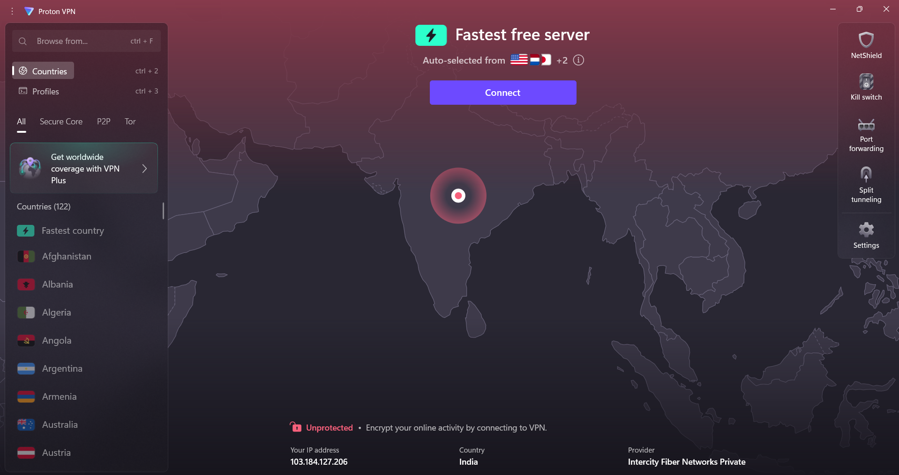

# Task 8: My Experience Setting Up ProtonVPN Free

## Overview

For this task, I wanted to learn how VPNs help protect privacy and keep internet communication secure. I decided to use ProtonVPN Free because it’s reputable, has no data limits, and is easy to set up. Here’s how I did it and what I learned along the way.

---

## What I Did

### 1. Choosing a Free VPN

After a bit of research, I picked **ProtonVPN Free**. I liked that it doesn’t keep logs and offers unlimited data, which is rare for a free VPN[2][3].

### 2. Signing Up and Creating My Account

- **I went to:** [protonvpn.com/free-vpn](https://protonvpn.com/free-vpn)
- **Clicked:** "Get Proton VPN Free"
- **Entered my email and created a username.**
- **Set a strong password** (I chose my own, but Proton also suggested one).
- **Verified my email** by entering the code I received in my inbox.

### 3. Downloading and Installing the VPN Client

- **Logged into my Proton account** and went to the "Downloads" section.
- **Selected Windows** (since that’s what I use).
- **Downloaded the installer and ran it.**
- **Followed the steps:** chose language, selected installation folder, and clicked "Install," then "Finish".
- **The whole process was quick and easy.**

### 4. Connecting to a VPN Server

- **Opened the ProtonVPN app** and logged in with my credentials.
- **Clicked "Quick Connect"** to automatically connect to the fastest free server.
- **The app showed "Connected"** and displayed the new server location.

### 5. Verifying My IP Address Changed

- **Opened my browser and went to:** [whatismyipaddress.com](https://www.whatismyipaddress.com/)
- **Checked my IP address:** It matched the location of the VPN server, not my real one.
- **Screenshot:** Below.

### 6. Browsing Securely

- **Visited:** [example.com](https://example.com)
- **The site loaded normally,** and I felt more secure knowing my traffic was encrypted.

### 7. Disconnecting and Comparing

- **Disconnected from the VPN** using the app.
- **Checked my IP address again:** It was back to my real location.
- **Compared browsing speed:** The VPN was a bit slower, but not by much.

---

## Screenshot

---

## What I Learned About VPN Encryption and Privacy

- **Encryption:** ProtonVPN uses AES-256 encryption, which means my data is scrambled and unreadable to anyone trying to spy on me.
- **No-logs policy:** ProtonVPN doesn’t keep records of what I do online, which is great for privacy.
- **Kill switch:** If the VPN drops, the app blocks my internet to keep my data safe.
- **Protocols:** It supports WireGuard and OpenVPN, which are secure and fast.

---

## The Good and the Not-So-Good

### Benefits

- **Privacy:** My real IP and location are hidden from websites and trackers.
- **Security:** All my internet traffic is encrypted, so it’s safe even on public Wi-Fi.
- **Access:** I can connect to servers in other countries, which is cool for accessing different content.
- **No-logs:** ProtonVPN doesn’t keep logs, so my activity isn’t recorded.

### Limitations

- **Speed:** The VPN can slow down my internet a bit because of the encryption and distance to the server.
- **Free plan limits:** Only a few countries are available for free users, and speeds are lower than paid plans.
- **Not 100% anonymous:** VPNs hide my IP, but things like cookies can still track me.
- **Trust:** I have to trust ProtonVPN not to misuse my data, but they have a good reputation.

---

## Interview Q&A (My Own Answers)

1. **What is a VPN?**  
   A VPN is a service that encrypts my internet connection and hides my real IP address by routing my traffic through a remote server.
2. **How does a VPN protect privacy?**  
   It encrypts my data and hides my location, making it harder for others to track what I do online.
3. **Difference between VPN and proxy?**  
   VPNs encrypt all my traffic and are more secure; proxies only reroute traffic and don’t encrypt.
4. **What is encryption in VPN?**  
   Encryption scrambles my data so only I and the VPN server can read it.
5. **Can VPN guarantee complete anonymity?**  
   No, VPNs hide my IP but can’t protect against all tracking methods, like cookies.
6. **What protocols do VPNs use?**  
   Common ones are WireGuard, OpenVPN, and IKEv2.
7. **What are some VPN limitations?**  
   Slower speeds, fewer server options on free plans, and not complete anonymity.
8. **How does a VPN affect network speed?**  
   It can slow down my connection because of encryption and the distance to the server.
---

## Conclusion

Setting up ProtonVPN Free was simple and gave me a better understanding of how VPNs work. I feel more secure knowing my internet traffic is encrypted and my real location is hidden. While there are some limitations, especially with free plans, ProtonVPN is a great choice for anyone who cares about privacy.
